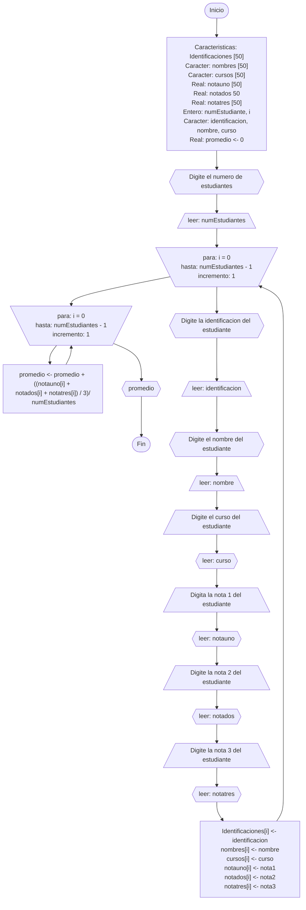

# Proyecto Base
> Author: Samuel Jeronimo Novoa Suta

## Enfoque
Se le ha asignado el desarrollo de una aplicación de consola simple para gestionar un proyecto de ventas de audífonos. La aplicación debe permitir a los usuarios ingresar información básica sobre los productos, como producto, precio y cantidad.

Teniendo en cuenta que el proyecto es en consola, la interfaz será de texto, y las funcionalidades se centrarán en la gestión eficiente de los datos y la facilidad de uso.
Aclaraciones:
+ La aplicación solo se requiere únicamente para calcular el descuento de una compra, según el total de esa compra.
+ Para efectos de simplicidad del ejemplo no se contemplan manejar persistencia en el almacenamiento de los datos.
+ No se realiza validación, ni se verifica calidad en los datos ingresados.

  

## Menu
- [Historial De Usuario](#historial-de-usario)
- [Aproximacion caso de uso](#aproximacion-caso-de-uso)
- [Diagrama de flujo](#diagrama-de-flujo)
- [Seudocodigo](#seudocodigo)

  

## Historial De Usario
[embed]descripcion.pdf[/embed]
### Descripción
Como vendedor, se debe poder capturar el precio de los productos de una compra para obtener el descuento del 10% del total de la compra de los productos.

**Escenario [ 1 ]:**
> ***Ingresar la información de los productos [ Código Producto | Nombre Del Producto | Cantidad Del Producto | Precio Del Producto ]***

### Equipo de desarrollo
| **Desarrollo Logico** | **Codificardor de codigo** | **Tester** |
|-----|-----|-----|
| Samuel Jeronimo Novoa Suta | Samuel Jeronimo Novoa Suta | Samuel Jeronimo Novoa Suta |

  

## Aproximacion caso de uso
**Nombre:** Tienda de audifonos.
**Actores:** Clientes, Desarrolladores, Administradores de proyecto.
**Porposito:** Gestionar todo el proceso de una tienda de audífonos, contando con stock, ventas y descripciones de productos.
**Curso Normal de Eventos:**
1. El cliente inicia la aplicación de la consola.
2. La aplicación muestra una lista de audífonos disponibles con información básica (nombre, precio, cantidad en stock).
3. El cliente selecciona un modelo de audífono de la lista.
4. La aplicación verifica si hay suficiente stock para el modelo seleccionado.
5. Si hay stock, la aplicación confirma la venta y actualiza el inventario.
6. Si no hay stock, la aplicación informa al cliente y le permite seleccionar otro modelo o salir de la aplicación.

  

## Diagrama de flujo

Desplegar

    

        

  

## Seudocodigo

Desplegar

        

