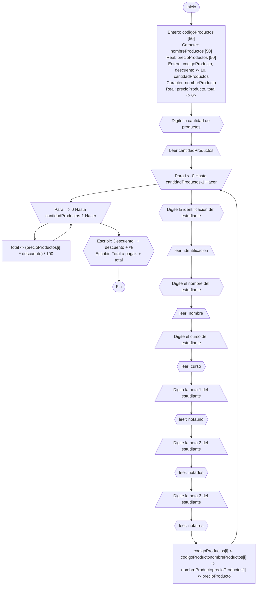

# Proyecto Base
> Author: Samuel Jeronimo Novoa Suta

## Enfoque
Se le ha asignado el desarrollo de una aplicación de consola simple para gestionar un proyecto de ventas de audífonos. La aplicación debe permitir a los usuarios ingresar información básica sobre los productos, como producto, precio y cantidad.

Teniendo en cuenta que el proyecto es en consola, la interfaz será de texto, y las funcionalidades se centrarán en la gestión eficiente de los datos y la facilidad de uso.
Aclaraciones:
+ La aplicación solo se requiere únicamente para calcular el descuento de una compra, según el total de esa compra.
+ Para efectos de simplicidad del ejemplo no se contemplan manejar persistencia en el almacenamiento de los datos.
+ No se realiza validación, ni se verifica calidad en los datos ingresados.

<br style="height:100px;"></br>

## Menu
- [Historial De Usuario](#historial-de-usario)
- [Aproximacion caso de uso](#aproximacion-caso-de-uso)
- [Diagrama de flujo](#diagrama-de-flujo)
- [Seudocodigo](#seudocodigo)

<br style="height:100px;"></br>

## Historial De Usario
[PDF](/Documentos/Descripci%C3%B3n.pdf)
### Descripción
Como vendedor, se debe poder capturar el precio de los productos de una compra para obtener el descuento del 10% del total de la compra de los productos.

**Escenario [ 1 ]:**
> ***Ingresar la información de los productos [ Código Producto | Nombre Del Producto | Cantidad Del Producto | Precio Del Producto ]***

+ **Given [** Soy el vendedor **]**
    + Ingreso correctamente el código del producto
    + Ingreso correctamente el nombre del producto
    + Ingreso correctamente la cantidad del producto
    + Ingreso correctamente el precio del producto

+ **Then [** Debo poder visualizar la información de la compra **]**
    + Productos comprados
    + Valor de los productos por unidad
    + Valor de la compra total
    + Valor del descuento total


### Equipo de desarrollo
| **Desarrollo Logico** | **Codificardor de codigo** | **Tester** |
|-----|-----|-----|
| Samuel Jeronimo Novoa Suta | Samuel Jeronimo Novoa Suta | Samuel Jeronimo Novoa Suta |

<br style="height:100px;"></br>

## Aproximacion caso de uso
**Nombre:** Tienda de audifonos<br>
**Actores:** Clientes, Desarrolladores, Administradores de proyecto.<br>
**Porposito:** Gestionar todo el proceso de una tienda de audífonos, contando con stock, ventas y descripciones de productos.<br>
**Curso Normal de Eventos:**
1. El vendedor ingresa la cantidad de productos a agregar.
2. El vendedor ingresa [ Código Producto | Nombre Del Producto | Cantidad Del Producto | Precio Del Producto ].
3. Se calcula el descuento del total de los productos a partir de: [ ``` (PrecioTotal * 10 ) / 100 ``` ].
4. Se muestra los productos, el precio de los productos por unidad, el totoal de la compra y el descuento.

<br style="height:100px;"></br>
## Diagrama de flujo
<details><summary>Desplegar</summary>
<p>
    

        
</p>
</details>

<br style="height:100px;"></br>

## Seudocodigo
<details><summary>Desplegar</summary>
        <p>
        ```
        
    Algoritmo proyecto
        Definir sc Como Nuevo Scanner
        Definir codigoProductos[50] Como Entero
        Definir nombreProductos[50] Como Caracter
        Definir precioProductos[50] Como Real
        Definir codigoProducto, descuento, cantidadProductos Como Entero
        Definir nombreProducto Como Caracter
        Definir precioProducto, total Como Real
        
        descuento <- 10
        total <- 0

        Escribir "Digite la cantidad de productos: "
        Leer cantidadProductos

        Para i <- 0 Hasta cantidadProductos-1 Hacer
            Escribir "Codigo del producto [" + i + "]: "
            Leer codigoProducto

            Escribir "Digite el nombre del producto [" + i + "]: "
            Leer nombreProducto

            Escribir "Digite el precio del producto [" + i + "]: "
            Leer precioProducto

            codigoProductos[i] <- codigoProducto
            nombreProductos[i] <- nombreProducto
            precioProductos[i] <- precioProducto
        Fin Para

        Para i <- 0 Hasta cantidadProductos-1 Hacer
            total <- (precioProductos[i] * descuento) / 100
        Fin Para

        Escribir "Descuento: " + descuento + "%"
        Escribir "Total a pagar: " + total

        Cerrar sc
    Fin Algoritmo

        ```

        </p>
</details>

<br style="height:100px;"></br>

## Codigo
| Estructurado | POO |
|----|----|
| [VER Codigo](/Porgramacion%20%5B%20EST%20-%20POO%5D/ESTRUCTURADA/proyecto.java) | [VER Codigo](/Porgramacion%20%5B%20EST%20-%20POO%5D/POO/Proyecto%20Estudiantes/) |
